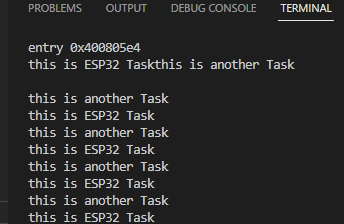

# Practica 3 Sistemss Operativos en tiempo Real

En esta practica trabajaremos la multitarea que nos permite realizar la ESP32 y el FreeRTOS. Gracias a la multitarea podemos realizar diferentes acciones a la misma vez como obtener informacion por un periferico y mostrar esta por otro periferico. Tambien trabajaremos el FreeRTOS que permite la utilizacion de diferentes nucleos para ejecutar diversas tareasy liberar carga del nucleo principal, ya que en el ide de arduino por defecto las ordenes se ejecutan en un solo nucleo del microprocesador.


```cpp

#include<Arduino.h>
void anotherTask( void * parameter );

void setup()
{
Serial.begin(112500);
/* we create a new task here */
xTaskCreate(
anotherTask, /* Task function. */
"another Task", /* name of task. */
10000, /* Stack size of task */
NULL, /* parameter of the task */
1, /* priority of the task */
NULL); /* Task handle to keep track of created task */
}
/* the forever loop() function is invoked by Arduino ESP32 loopTask */
void loop()
{
Serial.println("this is ESP32 Task");
delay(1000);
}
/* this function will be invoked when additionalTask was created */
void anotherTask( void * parameter )
{
/* loop forever */
for(;;)
{
Serial.println("this is another Task");
delay(1000);
}
/* delete a task when finish,
this will never happen because this is infinity loop */
vTaskDelete( NULL );
}
```
**Declaraciones**
```cpp
void anotherTask( void * parameter );
```
Primero de todo declaramos la tarea secundaria mas tarde declararemos las acciones que tendra.


**SETUP**

```cpp
void setup()
{
Serial.begin(112500);
/* we create a new task here */
xTaskCreate(
anotherTask, /* Task function. */
"another Task", /* name of task. */
10000, /* Stack size of task */
NULL, /* parameter of the task */
1, /* priority of  the task */
NULL); /* Task handle to keep track of created task */
}
```
En el setup inicializamos las tareas Serial y creamos la tarea dandole los valores del nombte l tamaño que ocupara en la memoria (en este caso 1000) 
parametros necesarios (NULL, no son necesarios para esta tarea)
la pioridad de la tarea siendo 1


**LOOP**
```cpp
void loop()
{
Serial.println("this is ESP32 Task");
delay(1000);
}
```
En este Loop el principal se ejecutara como de costumbre infinitamente en este caso la unica accion que realizara sera enviar por el Monitor Serial el siguiente mensaje " This is ESP32 Task"cada 1s para que podamos observar como se ejecutaran las dos tareas a la vez. 

**Tarea secundaria**

```cpp
void anotherTask( void * parameter )
{
    /* loop forever */
    for(;;)
    {
        Serial.println("this is another Task");
        delay(1000);
    }
    /* delete a task when finish,
    this will never happen because this is infinity loop */
    vTaskDelete( NULL );
}
```
Esta sera la tarea secundaria que se ejecutara a la vez que el main loop. En esta tarea las acciones que realiza es escribir un mensaje por el Serial monitor el siguente mensaje "this is another Task" cada 1s esta accion esta dentro de un for(;;) por lo tanto se ejecutara infinitamente, hay una linea que eliminaria la tarea pero esta nunca llega a ejecutarse ya que en el for no hay ningun trigger que que haga que se detenga

**Conclusion** 
En el monitor series cada 1 segundo se mostrara un mensaje proveniente de cada tarea simultaneamente


